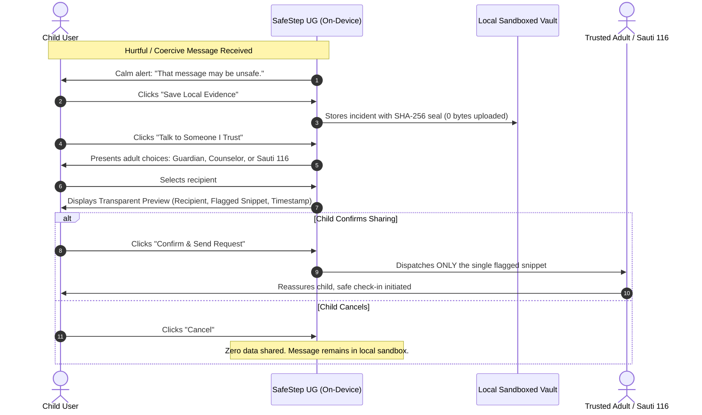

# SafeStep UG: Child Safeguarding & Privacy Governance Framework

> **Reference Standard:** UCC Testbed Hackathon 2026  
> **Applicable Laws:** Uganda Data Protection and Privacy Act (2019), Computer Misuse (Amendment) Act (2022), Children Act (Cap 59)  

---

## 1. Guiding Safeguarding Principles

SafeStep UG treats child safeguarding not as an optional feature, but as the governing architectural constraint. Every technical decision must satisfy the following core principles:

### 1.1 Child Agency Over Surveillance
Commercial "parental monitoring" software turns devices into covert listening stations. Children quickly discover these tools, resulting in evasive behavior (burner phones, unmonitored apps, hidden folders) and a breakdown of family trust. SafeStep UG inverts this paradigm:
* The child is the primary actor.
* Notifications are supportive, calm, and actionable.
* The child decides whether to mute, pause, save evidence, or share with an adult.

### 1.2 Data Minimisation by Architecture
Under Section 3 of Uganda’s *Data Protection and Privacy Act, 2019*, personal data must be collected only for lawful, specific purposes and kept to the strict minimum necessary:
* **Zero Cloud Ingestion:** Chat text, voice notes, and media files are evaluated inside the device memory and discarded immediately after classification.
* **No Profiling:** No user behavioral dossiers, sentiment tracking, or advertising identifiers are built.
* **No Third-Party Trackers:** The prototype contains zero third-party analytics or commercial ad SDKs.

### 1.3 Dignity & Non-Shaming Communication
Children who receive sexualised solicitations, nude requests, or peer blackmail often feel intense guilt, confusion, and fear of punishment. SafeStep UG:
* Never uses shaming or accusatory phrasing (e.g. *"You broke school rules"*).
* Always reinforces: *"You didn't do anything wrong, and you don't have to reply."*
* Offers emotional de-escalation tools, including guided breathing exercises, before any decision is made.

### 1.4 Algorithmic Humility & False Alarm Mitigation
No NLP or Computer Vision model is 100% accurate. Treating model classifications as absolute proof causes devastating false accusations against innocent peer humor or friendly sports banter.
* Every model classification is labeled an **"Advisory Signal"**, never a verdict.
* Clear uncertainty intervals (e.g., `±15.8%`) are displayed.
* A single-tap **"Dismiss as Friendly Teasing"** button allows the child to recalibrate model thresholds for trusted peers.

---

## 2. Trusted Adult Escalation & Chain-of-Custody

### 2.1 The Transparent Preview Guarantee
Before any notification is dispatched to an adult, the child is shown a **Transparent Preview Card**:
1. Exact recipient name and relationship.
2. The specific message snippet flagged.
3. Timestamp and sender handle.
4. Child-selected note (e.g., *"I felt uncomfortable and wanted your advice."*).

No other chats, photos, or browsing history are ever attached or accessible to the recipient.

---

## 3. Local Legal & Regulatory Alignment (Uganda)

| Ugandan Law / Policy | Legal Requirement | SafeStep UG Safeguard |
|---|---|---|
| **Data Protection and Privacy Act, 2019** (Section 3) | Data minimisation, security of personal data, lawful processing of children's data. | On-device execution, zero cloud database, cryptographic SHA-256 integrity seal, local data shredding. |
| **Computer Misuse (Amendment) Act, 2022** (Section 26B) | Prohibition of unsolicited offensive communication, cyber harassment, and online blackmail. | Identifies coercion and extortion markers (e.g., Mobile Money blackmail) and guides child to report safely. |
| **UCC Child Online Protection (COP) Guidelines** | Creation of safe, educational digital environments that empower children. | Age-appropriate language, local ecosystem referral (Sauti 116), no invasive spyware. |
| **Children Act (Cap 59, as amended)** | Protection of the child from sexual abuse, exploitation, and psychological harm. | Immediate escalation route to Uganda National Child Helpline (Toll-free 116). |

---

## 4. Multilingual & Local Dialect Evaluation Strategy

Uganda has diverse linguistic communities, with Luganda, Runyankole-Rukiga, Acholi, and street Sheng frequently blended with English in youth communication:
* **Current Status:** Prototype features a dedicated **Luganda Evaluation Lab** with synthetic test cases.
* **Strict Ethical Boundary:** In strict adherence to hackathon guidelines, **no claims of reliable multilingual classification are made** until formal evaluation has been completed by native-speaker linguists and child-protection experts.
* **Uncertainty Flagging:** Any non-English phrase evaluated by the prototype is explicitly marked: *"Evaluation Benchmark • Requires native-speaker safeguarding review before production validation."*

---

## 5. Post-Hackathon Responsible Validation Roadmap

1. **Phase 1: Expert Safeguarding Review (Nov 2026 - Dec 2026)**
   - Conduct workshops with Uganda Child Rights NGO Network (UCRNN) and Ministry of Gender, Labour and Social Development officials.
   - Audit all child-facing prompt phrasing with certified child psychologists.

2. **Phase 2: Local Language Corpus Collection (Jan 2027 - Mar 2027)**
   - Curate ethically gathered, synthetic Luganda and youth-slang test datasets in partnership with university researchers at UICT and Makerere.

3. **Phase 3: Controlled Co-Design Pilot (Apr 2027 - Jun 2027)**
   - Institutional Review Board (IRB) ethical clearance.
   - Dual-consent protocol (child assent + guardian consent).
   - Low-bandwidth field testing in select Kampala primary and secondary schools.

---

*Document Version 1.0 — UCC Testbed Hackathon 2026, UICT Nakawa*
